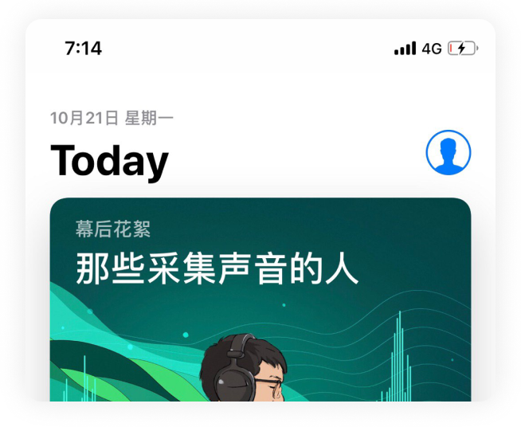
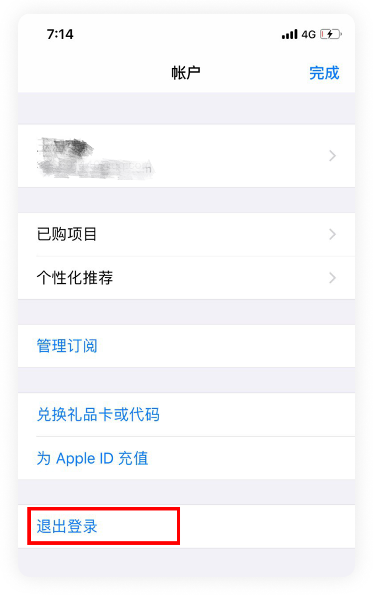
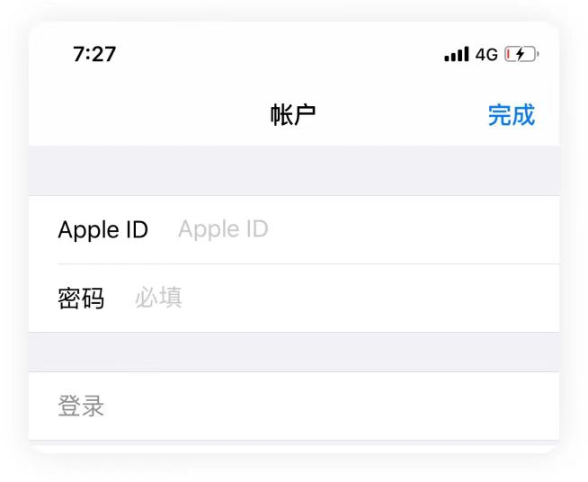
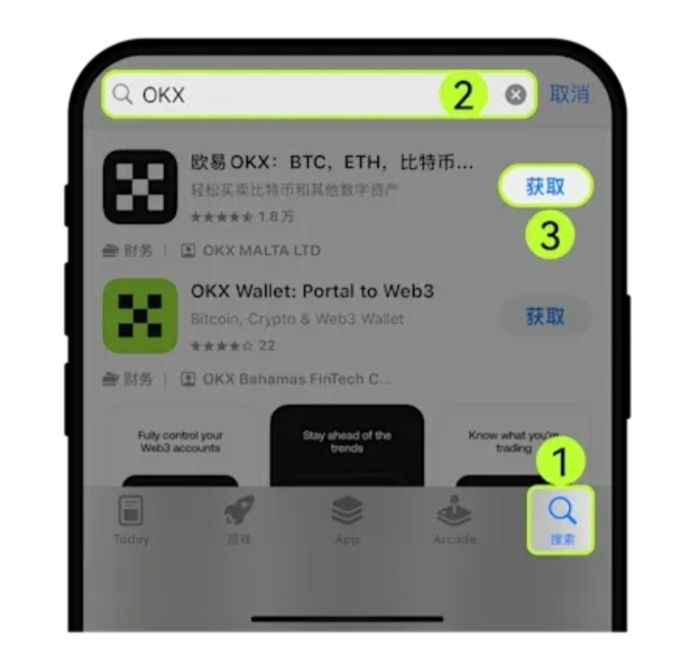

一 注册  欧意OKX：https://www.pdzheo.com/join/33063084 
币安Binance：https://accounts.maxweb.black/register?ref=CHI88  
复制到浏览器打开，注册好了再看教程。   二 如何切换苹果ID并下载 1 第一步，点击App Store首页右上角头像   

  2 第二步，点击退出登录，重新输入Apple ID及密码。  

 3 第三步，输入非大陆苹果账号。你可以使用以下账号和密码登录  
   账号：kkbcss@163.com 密码：$Rich123   上边是账户 下面是密码 复制登录。因为ID是私人ID  不是公用ID    登录会需要填码   私聊我就好了     第四步，搜索OKX App。  
  
  
三 使用说明 切记，玩币圈一定要填邀请码，欧意/币安只有注册的时候那一次机会!错过了没法重新填! 填我的邀请码后续每周一会反还你的交易手续费，和每月欧意/币安精品周边赠送。 填了邀请码的之后有什么不懂的都可以免费问我。

